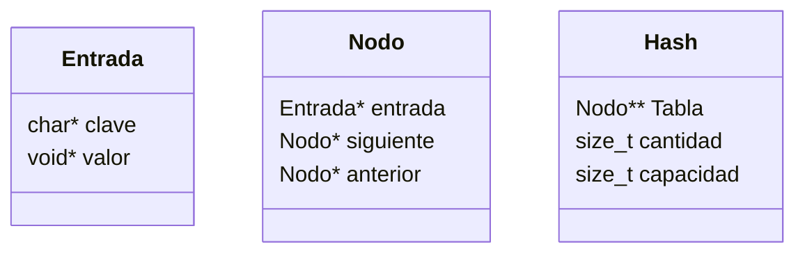
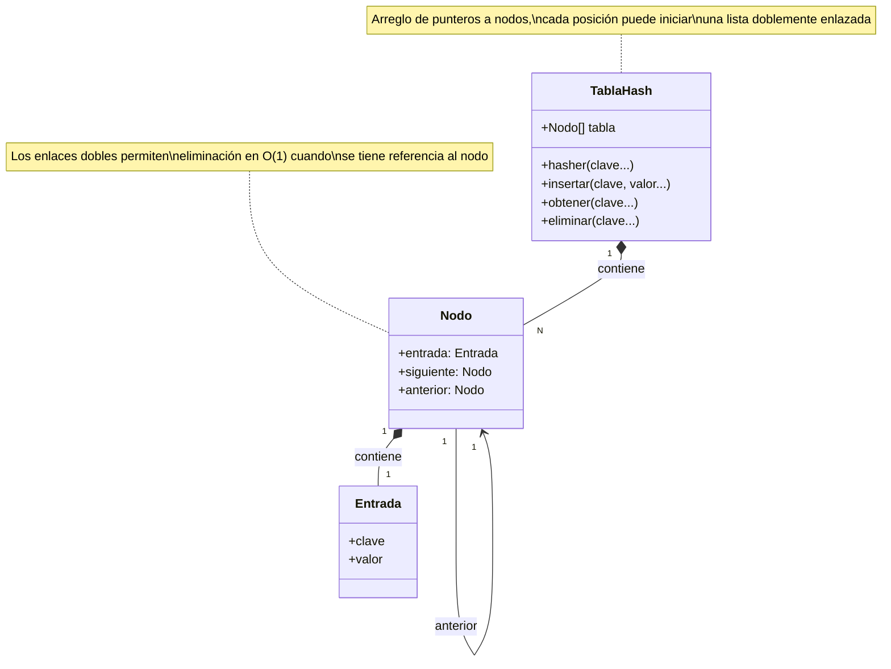
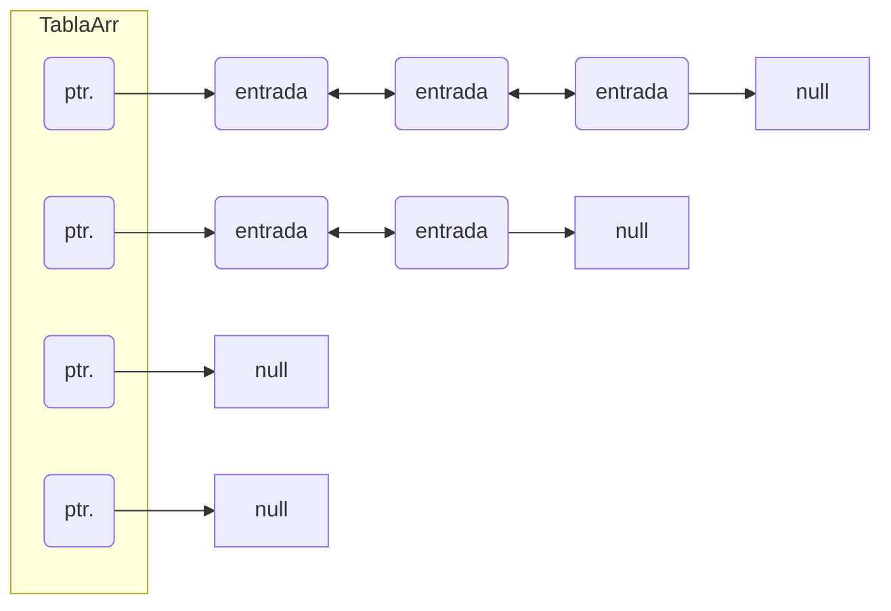

<div align="right">

</div>

# TDA HASH

## Repositorio de (Marlon Stiven Molina Buitrago) - (112018) - (mmolinab@fi.uba.ar)

- Para compilar:

```bash
make build
```

- Para ejecutar:

```bash
make run
```

- Para ejecutar con valgrind:
```bash
make valgrind-run
```
---
##  Funcionamiento

El TP Hash es un tipo de diccionario implementado con una tabla de Hash, para poder lograr una complejidad de búsqueda constante.
Para poder resolver las colisiones, se usa una tabla que guarda el primero de diferentes nodos enlazados, estos vienen conectados y se usan para la búsqueda eficiente.

#### Diagramas de estructuras


#### Diagramas relación estructuras


#### Funcionamiento de tabla hash

### Por ejemplo:

El programa funciona abriendo el archivo pasado como parámetro y leyéndolo línea por línea. Por cada línea crea un registro e intenta agregarlo al vector. La función de lectura intenta leer todo el archivo o hasta encontrar el primer error. Devuelve un vector con todos los registros creados.

### Estructura del Programa

El programa está dividido en varios archivos, cada uno con responsabilidades específicas:

1. **tp_hash.c**: Contiene la función principal (`main`) y la lógica de interacción con el usuario.
2. **csv.c y csv.h**: Manejan la lectura de archivos CSV.
3. **hash.c y hash.h**: Implementan la tabla hash.
4. **pokemon.c y pokemon.h**: Definen las operaciones relacionadas con los Pokémon.
5. **str_split.c y str_split.h**: Proveen funciones para dividir cadenas.
6. **tipos.c y tipos.h**: Definen tipos y funciones auxiliares.
7. **io_utils.c y io_utils.h**: Contienen funciones de utilidad para leer diferentes tipos de datos.
8. **hash_utils.c y hash_utils.h**: Contienen funciones auxiliares para la tabla de hash.

### Funcionamiento del Programa

#### 1. Función Principal Programa

La función `main` en `tp_hash.c` es el punto de entrada del programa. Su flujo es el siguiente:

1. **Verificación de Argumentos**: Verifica que se haya pasado un archivo CSV como argumento.
2. **Apertura del Archivo CSV**: Utiliza `abrir_archivo_csv` para abrir el archivo CSV.
3. **Creación de la Tabla Hash**: Crea una tabla hash con una capacidad inicial de 20.
4. **Carga de Pokémon**: Llama a `agregar_pokemones` para leer los Pokémon del archivo CSV y agregarlos a la tabla hash.
5. **Interacción con el Usuario**: Muestra un menú para que el usuario elija entre buscar un Pokémon o listar todos los Pokémon.
6. **Ejecución de la Opción del Usuario**: Dependiendo de la opción elegida, llama a `buscar_pokemon` o `hash_iterar` para listar los Pokémon.
7. **Liberación de Recursos**: Destruye la tabla hash y cierra el archivo CSV.

#### 2. Manejo de Archivos CSV (`csv.c` y `csv.h`)

- **abrir_archivo_csv**: Abre un archivo CSV y devuelve un puntero a una estructura `archivo_csv`.
- **leer_linea_csv**: Lee una línea del archivo CSV y la divide en columnas utilizando un separador.
- **cerrar_archivo_csv**: Cierra el archivo CSV y libera la memoria asociada.

#### 3. Implementación de la Tabla Hash (`hash.c` y `hash.h`)

- **hash_crear**: Crea una tabla hash con una capacidad inicial.
- **hash_insertar**: Inserta un elemento en la tabla hash.
- **hash_buscar**: Busca un elemento en la tabla hash.
- **hash_quitar**: Elimina un elemento de la tabla hash.
- **hash_iterar**: Itera sobre todos los elementos de la tabla hash y aplica una función a cada uno.
- **hash_destruir** y **hash_destruir_todo**: Destruyen la tabla hash y liberan la memoria.

#### 4. Operaciones con Pokémon (`pokemon.c` y `pokemon.h`)

- **leer_pokemon**: Lee un Pokémon del archivo CSV.
- **agregar_pokemones**: Agrega todos los Pokémon del archivo CSV a la tabla hash.
- **liberar_pokemon**: Libera la memoria asociada a un Pokémon.
- **print_pokemon**: Imprime la información de un Pokémon.
- **buscar_pokemon**: Busca un Pokémon en la tabla hash por su nombre.

#### 5. División de Cadenas (`split.c` y `split.h`)

- **dividir_string**: Divide una cadena en partes utilizando un separador.
- **liberar_partes**: Libera la memoria asociada a las partes de una cadena dividida.

#### 6. Tipos y Funciones Auxiliares (`tipos.c` y `tipos.h`)

- **hasher**: Función de hash para calcular el índice de una clave en la tabla hash.

#### 7. Funciones de Utilidad (`utils.c` y `utils.h`)

- **read_int**: Lee un entero de una cadena.
- **read_string**: Lee una cadena y la copia en un nuevo espacio de memoria.
- **read_char**: Lee un carácter de una cadena.

### Ejecución del Programa

El programa mostrará un menú para que el usuario elija entre buscar un Pokémon o listar todos los Pokémon. Dependiendo de la opción elegida, el programa realizará la acción correspondiente y mostrará los resultados en la consola.

### Conclusión

El programa `tp_hash` es una aplicación completa que utiliza una tabla hash para gestionar una base de datos de Pokémon. La estructura modular del código facilita su mantenimiento y expansión. Cada componente tiene una responsabilidad clara, lo que permite una fácil comprensión y modificación del código.

En el archivo `sarasa.c` la función `funcion1` utiliza `realloc` para agrandar la zona de memoria utilizada para conquistar el mundo. El resultado de `realloc` lo guardo en una variable auxiliar para no perder el puntero original en caso de error:

Una de las funciones más importantes en esta implementación de hash es la de `rehash` ya que es la que garantiza que el `hashmap` se pueda usar con cualquier número de pares clave-valor. Toma todas las entradas que hay en la tabla, las añade a una nueva y luego elimina la vieja. Esto garantiza la integridad de los índices dados por el hash y el correcto funcionamiento de la búsqueda de los valores por cada clave.

```c
static bool hash_rehash(hash_t *hash)
{
	hash->cap *= 2;
	nodo_t **tabla_vieja = hash->tabla;
	nodo_t **tabla = calloc(hash->cap, sizeof(nodo_t *));
	if (!tabla)
		return false;
	hash->tabla = tabla;
	hash->size = 0;
	for (size_t i = 0; i < hash->cap / 2; i++) {
		nodo_t *nodo = tabla_vieja[i];
		while (nodo) {
			nodo_t *siguiente = nodo->sig;
			if (!agregar_entrada(hash, nodo->entrada->clave,
					     nodo->entrada->valor))
				return false;
			free(nodo->entrada);
			free(nodo);
			nodo = siguiente;
			hash->size++;
		}
	}
	free(tabla_vieja);
	return true;
}
```

---

## Respuestas a las preguntas teóricas

### Qué es un diccionario
Un diccionario es un tipo de dato abstracto que permite almacenar pares de clave-valor. Su principal funcionalidad es la de asociar un valor a una clave específica y permitir la recuperación eficiente del valor correspondiente a una clave dada. Las operaciones básicas que soporta un diccionario son:
- **Insertar**: Añadir un par clave-valor al diccionario.
- **Buscar**: Recuperar el valor asociado a una clave específica.
- **Eliminar**: Remover un par clave-valor del diccionario.

### Formas de implementar un diccionario
1. **Hashmap**: Utiliza una función de hash para calcular un índice a partir de la clave, y almacena el valor en la posición correspondiente de una tabla. La función de hash distribuye las claves uniformemente a lo largo de la tabla para minimizar colisiones.
   - **Ventajas**: Búsqueda, inserción y eliminación en tiempo promedio O(1).
   - **Desventajas**: Manejo de colisiones y necesidad de una buena función de hash.

2. **Árbol Binario de Búsqueda (BST)**: Almacena los pares clave-valor en un árbol binario de búsqueda, donde cada nodo tiene una clave mayor que todas las claves en su subárbol izquierdo y menor que todas las claves en su subárbol derecho.
   - **Ventajas**: Búsqueda, inserción y eliminación en tiempo O(log n) en promedio.
   - **Desventajas**: Claves deben ser comparables y en árbol desbalanceado), las operaciones pueden ser O(n).

3. **Lista Enlazada**: Almacena los pares clave-valor en una lista enlazada simple.
   - **Ventajas**: Implementación sencilla.
   - **Desventajas**: Búsqueda, inserción y eliminación en tiempo O(n).

### Función de hash
Una función de hash es una función que toma una entrada (o clave) y devuelve un número entero, que se utiliza como índice en una tabla de hash. Las características que debe tener una buena función de hash son:
- **Determinística**: La misma entrada siempre debe producir el mismo resultado.
- **Uniforme**: Debe distribuir las claves uniformemente a lo largo de la tabla para minimizar colisiones.
- **Eficiente**: Debe ser rápida de calcular.
- **Minimizar colisiones**: Debe reducir la probabilidad de que dos claves diferentes produzcan el mismo índice.

### Tabla de hash y resolución de colisiones
Una tabla de hash es una estructura de datos que utiliza una función de hash para mapear claves a índices en una tabla. Los métodos de resolución de colisiones incluyen:

1. **Encadenamiento**: Cada posición de la tabla contiene una lista enlazada de todos los pares clave-valor que tienen el mismo índice de hash.
   - **Ventajas**: Maneja bien las colisiones y permite una tabla de tamaño fijo.
   - **Desventajas**: Puede degradarse a O(n) en el peor caso si muchas claves colisionan.

2. **Probing Lineal**: Si una posición está ocupada, se busca la siguiente posición libre en la tabla.
   - **Ventajas**: Simple de implementar.
   - **Desventajas**: Puede causar clustering, donde muchas claves colisionan y se agrupan.

3. **Probing Cuadrático**: Similar al probing lineal, pero la distancia entre las posiciones probadas aumenta cuadráticamente.
   - **Ventajas**: Reduce el clustering comparado con el probing lineal.
   - **Desventajas**: Más complejo de implementar y puede ser menos eficiente en algunos casos.

### Importancia del tamaño de la tabla (Hash abierto y cerrado)
El tamaño de la tabla es crucial para el rendimiento de una tabla de hash. Un tamaño adecuado minimiza las colisiones y mantiene las operaciones de búsqueda, inserción y eliminación eficientes.

- **Hash Abierto (Encadenamiento)**: Aunque las colisiones se manejan mediante listas enlazadas, un tamaño de tabla pequeño puede llevar a listas largas, degradando la complejidad de las operaciones a O(n/k), donde k es el tamaño de la tabla.
- **Hash Cerrado (Probing)**: Un tamaño de tabla pequeño puede llevar a muchas colisiones y clustering, degradando la eficiencia de las operaciones.

### Importancia de la capacidad en un Hash abierto
En una tabla abierta, el tamaño de la tabla sigue siendo importante porque afecta la longitud de las listas enlazadas en cada posición. Si la tabla es demasiado pequeña, las listas se vuelven largas y la complejidad de las operaciones se degrada a O(n/k), donde n es el número de elementos y k es el tamaño de la tabla. Por lo tanto, un tamaño adecuado de la tabla es crucial para mantener la eficiencia.

### Dibujos explicativos
#### Tabla de Hash con Encadenamiento
```
Tabla de Hash:
+---+---+---+---+---+
| 0 | 1 | 2 | 3 | 4 |
+---+---+---+---+---+
  |   |   |   |   |
  v   v   v   v   v
 [ ] [ ] [ ] [ ] [ ]
  |   |   |   |   |
  v   v   v   v   v
[ ] [ ] [ ] [ ] [ ]
```

#### Tabla de Hash con Probing Lineal
```
Tabla de Hash:
+---+---+---+---+---+
| 0 | 1 | 2 | 3 | 4 |
+---+---+---+---+---+
  |   |   |   |   |
  v   v   v   v   v
[ ] [ ] [ ] [ ] [ ]
```

En el caso de una colisión, se busca la siguiente posición libre:
```
+---+---+---+---+---+
| 0 | 1 | 2 | 3 | 4 |
+---+---+---+---+---+
  |   |   |   |   |
  v   v   v   v   v
[ ] [X] [ ] [ ] [ ]
      |
      v
    [X]
```
