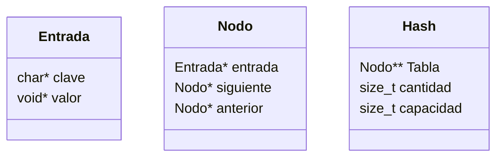
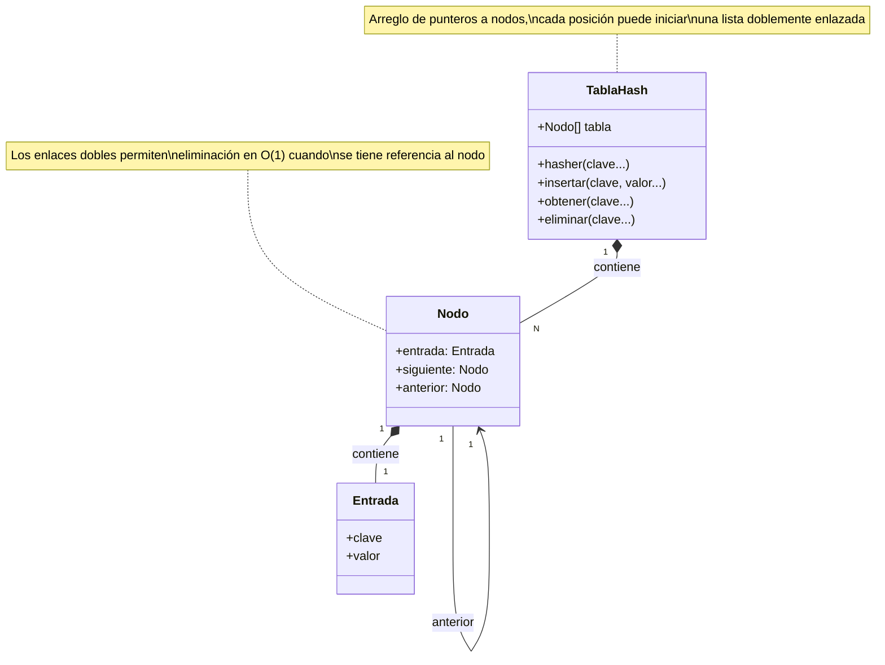
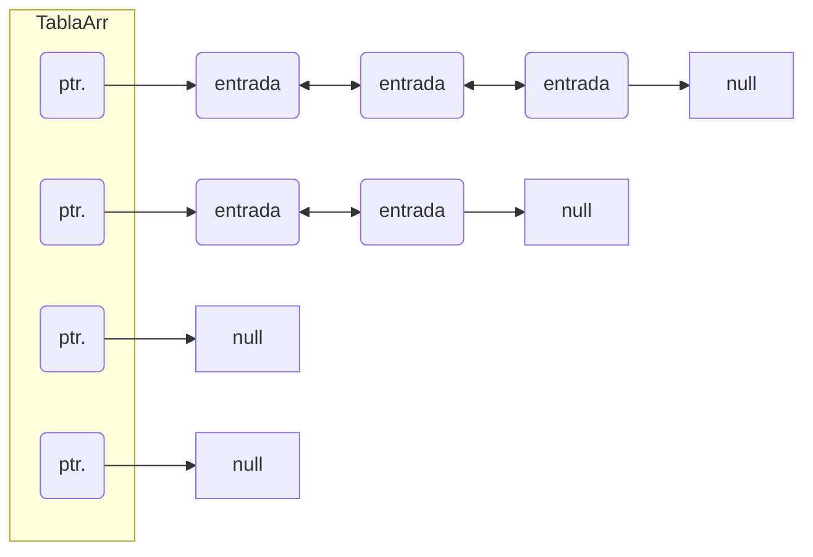

<div align="right">

</div>

# TDA HASH

## Repositorio de (Marlon Stiven Molina Buitrago) - (112018) - (mmolinab@fi.uba.ar)

- Para compilar:

```bash
make build
```

- Para ejecutar:

```bash
./tp_hash pokedex.csv
```

- Para ejecutar con valgrind:
```bash
valgrind ./tp_hash pokedex.csv
```
---
##  Funcionamiento

El TP Hash es un tipo de diccionario implementado con una tabla de Hash, para poder lograr una complejidad de buscueda constante.
Para poder resolver las colisiones, se usa una tabla que guarda el primero de diferentes nodos enlazados, estos vienen conectados y se usan para la busqueda eficiente.

#### Diagramas de estructuras


#### Diagramas relacion estructuras


#### Funcionamiento de tabla hash

### Por ejemplo:

El programa funciona abriendo el archivo pasado como parámetro y leyendolo línea por línea. Por cada línea crea un registro e intenta agregarlo al vector. La función de lectura intenta leer todo el archivo o hasta encontrar el primer error. Devuelve un vector con todos los registros creados.

### Estructura del Programa

El programa está dividido en varios archivos, cada uno con responsabilidades específicas:

1. **tp_hash.c**: Contiene la función principal (`main`) y la lógica de interacción con el usuario.
2. **csv.c y csv.h**: Manejan la lectura de archivos CSV.
3. **hash.c y hash.h**: Implementan la tabla hash.
4. **pokemon.c y pokemon.h**: Definen las operaciones relacionadas con los Pokémon.
5. **split.c y split.h**: Proveen funciones para dividir cadenas.
6. **tipos.c y tipos.h**: Definen tipos y funciones auxiliares.
7. **utils.c y utils.h**: Contienen funciones de utilidad para leer diferentes tipos de datos.

### Funcionamiento del Programa

#### 1. Función Principal Programa

La función `main` en `tp_hash.c` es el punto de entrada del programa. Su flujo es el siguiente:

1. **Verificación de Argumentos**: Verifica que se haya pasado un archivo CSV como argumento.
2. **Apertura del Archivo CSV**: Utiliza `abrir_archivo_csv` para abrir el archivo CSV.
3. **Creación de la Tabla Hash**: Crea una tabla hash con una capacidad inicial de 20.
4. **Carga de Pokémon**: Llama a `agregar_pokemones` para leer los Pokémon del archivo CSV y agregarlos a la tabla hash.
5. **Interacción con el Usuario**: Muestra un menú para que el usuario elija entre buscar un Pokémon o listar todos los Pokémon.
6. **Ejecución de la Opción del Usuario**: Dependiendo de la opción elegida, llama a `buscar_pokemon` o `hash_iterar` para listar los Pokémon.
7. **Liberación de Recursos**: Destruye la tabla hash y cierra el archivo CSV.

#### 2. Manejo de Archivos CSV (`csv.c` y `csv.h`)

- **abrir_archivo_csv**: Abre un archivo CSV y devuelve un puntero a una estructura `archivo_csv`.
- **leer_linea_csv**: Lee una línea del archivo CSV y la divide en columnas utilizando un separador.
- **cerrar_archivo_csv**: Cierra el archivo CSV y libera la memoria asociada.

#### 3. Implementación de la Tabla Hash (`hash.c` y `hash.h`)

- **hash_crear**: Crea una tabla hash con una capacidad inicial.
- **hash_insertar**: Inserta un elemento en la tabla hash.
- **hash_buscar**: Busca un elemento en la tabla hash.
- **hash_quitar**: Elimina un elemento de la tabla hash.
- **hash_iterar**: Itera sobre todos los elementos de la tabla hash y aplica una función a cada uno.
- **hash_destruir** y **hash_destruir_todo**: Destruyen la tabla hash y liberan la memoria.

#### 4. Operaciones con Pokémon (`pokemon.c` y `pokemon.h`)

- **leer_pokemon**: Lee un Pokémon del archivo CSV.
- **agregar_pokemones**: Agrega todos los Pokémon del archivo CSV a la tabla hash.
- **liberar_pokemon**: Libera la memoria asociada a un Pokémon.
- **print_pokemon**: Imprime la información de un Pokémon.
- **buscar_pokemon**: Busca un Pokémon en la tabla hash por su nombre.

#### 5. División de Cadenas (`split.c` y `split.h`)

- **dividir_string**: Divide una cadena en partes utilizando un separador.
- **liberar_partes**: Libera la memoria asociada a las partes de una cadena dividida.

#### 6. Tipos y Funciones Auxiliares (`tipos.c` y `tipos.h`)

- **hasher**: Función de hash para calcular el índice de una clave en la tabla hash.

#### 7. Funciones de Utilidad (`utils.c` y `utils.h`)

- **read_int**: Lee un entero de una cadena.
- **read_string**: Lee una cadena y la copia en un nuevo espacio de memoria.
- **read_char**: Lee un carácter de una cadena.

### Ejecución del Programa

El programa mostrará un menú para que el usuario elija entre buscar un Pokémon o listar todos los Pokémon. Dependiendo de la opción elegida, el programa realizará la acción correspondiente y mostrará los resultados en la consola.

### Conclusión

El programa `tp_hash` es una aplicación completa que utiliza una tabla hash para gestionar una base de datos de Pokémon. La estructura modular del código facilita su mantenimiento y expansión. Cada componente tiene una responsabilidad clara, lo que permite una fácil comprensión y modificación del código.

En el archivo `sarasa.c` la función `funcion1` utiliza `realloc` para agrandar la zona de memoria utilizada para conquistar el mundo. El resultado de `realloc` lo guardo en una variable auxiliar para no perder el puntero original en caso de error:

Una de las funciones mas importantes en esta implementacion de hash es la de `rehash` ya que es la que garanteriza que el `hashmap` se pueda usar con cualquier numero de pares clave valor, toma todas las entradas que hay en la tabla las añade a una nuevo para luego eliminar la vieja, esto garantiza la integradidad de los indices dados por el hash y el correcto funcionamiento de la busqueda de los valores por cada clave.

```c
static bool hash_rehash(hash_t *hash)
{
	hash->cap *= 2;
	nodo_t **tabla_vieja = hash->tabla;
	nodo_t **tabla = calloc(hash->cap, sizeof(nodo_t *));
	if (!tabla)
		return false;
	hash->tabla = tabla;
	hash->size = 0;
	for (size_t i = 0; i < hash->cap / 2; i++) {
		nodo_t *nodo = tabla_vieja[i];
		while (nodo) {
			nodo_t *siguiente = nodo->sig;
			if (!agregar_entrada(hash, nodo->entrada->clave,
					     nodo->entrada->valor))
				return false;
			free(nodo->entrada);
			free(nodo);
			nodo = siguiente;
			hash->size++;
		}
	}
	free(tabla_vieja);
	return true;
}
```

---

## Respuestas a las preguntas teóricas
Incluír acá las respuestas a las preguntas del enunciado (si aplica).

- ### Qué es un diccionario
  Un diccionario es un tipo de dato abstracto que tiene la funcionalidad de poder asignar un valor a una clave en especifico, con el objetivo de poder encontrar el valor asignado a una clave, dando esta ultima, por lo que se podria definir por:
    * La habilidad de asignar este valor a la clave y añadiendolo al diccionario
    * La habilidad de encontrar un valor teniendo una clave

- ### Formas de implementar un diccionario
  * Hashmap: Esta implementacion usa indices dados por una funcion de hasheo para asignar el valor a cada clave

  * Vectorial: Cada par clave valor es guardado directamente en un vector sin hacer ningun calculo de hasheo, la busqueda del valor en esta implementacion es O(n) porque es necesario iterar sobre el vector para ver si se encuentra la clave

- ### Funcion de hash
  Una funcion de hash es una que asigna un numero u otro identificador , tiene diferentes usos en el tema de la seguridad o en este caso para la facilidad de bajarle la complejidad a una implementacion de TDA (el diccionario), esta funcion tiene que tener la caracteristica:
  * Dar el mismo resultado para el mismo argumento
  * Dar resultados aparentemente aleatorios para el argumento

- ### Tabla de hash y resolucion de colisiones
  Una tabla de hash es una estructura que usa una funcion de hasheo para asignar un par clave valor a una tabla, teniendo un comportamento que similar a un vector en complejidad.
  * Encadenamiento: Es utilizar una estructura de dato alternativa para guardar aquellos pares claves valor que fueron asignados a un mismo indice de hash
  * Probing: Es asignar todos los elementos del hash en la misma estructura de la tabla, resolviendo colisiones moviendo los elementos al proximo lugar libre.

- ### Importancia tamaño de la tabla (Hash abierto y cerrado)
  El tamaño de una tabla es importante porque esto tiene que ver directamente con la cantidad de rehash que se tienen que hacer en el programa, y estos rehash son la parte mas costosa en tiempo y computacionalmente, por lo que elegir una cantidad adecuada puede hacer la diferencia en el performance de la aplicacion

- ### Importancia de la capacidad en un Hash abierto
  En una tabla abierta es realmente importante el tamaño de la tabla, ya que este hara la diferencia en la complejidad de la busqueda, el tener un tabla con un tamaño demasiado pequeño generara que la busqueda no sea O(1) sino que se degrade a O(n), ya que entonces aun con una buena funcion de hash cada estructura de datos encadenada tendra aproximadamente n / k elementos, siendo n el numero de elementos totales y k el la capacidad de la tabla
